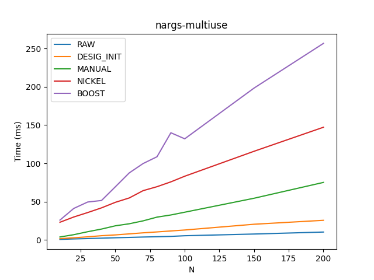

# Benchmarks

How does Nickel stack up verses that "competitors" in terms of compilation time?

Competitors:
  - RAW: A regular function call, no named arguments
  - DESIG_INIT: Designated initializers to imitate named arguments
  - MANUAL: Using a variation of the "Named Parameters Idiom" to imitate named arguments
  - NICKEL: Using Nickel
  - BOOST: Using Boost::Parameters

# Use

## Multi-use, with 5 args

Using a function that has 5 arguments N times.
This aims to be a mostly realistic benchmark.

